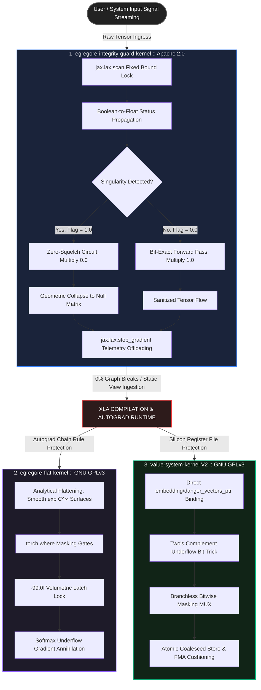

# egregore-integrity-guard-kernel (Apache 2.0)

High-performance, compiler-native data pipeline verification gate engineered in JAX/XLA. Eradicates dynamic loop overheads and runtime `ConcretizationTypeError` anomalies via compile-time bounded loop unrolling and strict branchless algebraic masking.

---

## The High-Performance Paradigm

In large-scale distributed training infrastructures (e.g., LLM foundation runs), the inclusion of dynamic loops (`while/break`) or Python-level conditional branches (`if/else`) to inspect incoming data streams poses a severe threat to hardware acceleration. These algorithmic control flows trigger **Graph Fragmentation** and severe **Host-Device Synchronization Bottlenecks (GPU/TPU Stall)**, shattering the compile-time optimization guarantees of the XLA compiler.

`egregore-integrity-guard-kernel` serves as an ultra-fast, non-blocking data firewall placed at the absolute front-end of the training data pipeline. It evaluates numerical stability, scan convergence speed, and latent space structural anomalies using an inline, purely mathematical approach—achieving **0% Graph Breaks** and maintaining continuous accelerator saturation.

---

## Infrastructure Topology

`egregore-integrity-guard-kernel` acts as the definitive, autograd-isolated intake shield within the PJHkorea Zero-Branching paradigm. The entire infrastructure eliminates traditional imperative control loops, processing inputs as a continuous, unified data-flow continuum:



---
## Core Architectural Features

* **Strict Bounded Loop Unrolling (`jax.lax.scan` Lock):** Purges dynamic code evaluation. Enforces a rigid iteration maximum directly into the XLA compiler graph, enabling full hardware pipelining without branch mispredictions.
* **Inline Gating Status Propagation:** Tracks tracking-state convergence velocities by computing cumulative boolean-to-float masking coefficients ($1.0$ or $0.0$) inside the accelerator's ALU, freezing unneeded iterations without executing a `break` jump.
* **The Zero-Squelch Circuit:** Neutralizes toxic data blocks (e.g., subnormal values or floating-point singularities that cause `NaN` explosions) by algebraically collapsing the input matrix into a pure $0.0$ state, bypassing downstream training corruption without crashing the pipeline.
* **Autograd-Isolated Metric Offloading:** Wraps logging counters with `jax.lax.stop_gradient` protocols, fully isolating runtime telemetry diagnostics from backpropagation tracking overheads.

---

## Mathematical Zero-Squelch Mechanics

The core philosophy of `egregore-integrity-guard-kernel` is to avoid runtime CPU hardware interrupts or Python-level conditional branches (`if/break`) that fragment the XLA compilation pipeline. Instead, it handles anomaly isolation entirely via analytical manifold squeezing.

### 1. Bounded Trace and Status Propagation
Given a multidimensional input tensor, the kernel enforces a hard static loop bound ($N_{max} = 32$) inside `jax.lax.scan`. The internal recurrence relation computes the divergence delta without routing control flows:

$$\Delta_{k} = | \mathbf{x}_{k} - \mathbf{x}_{k-1} |$$

The boolean convergence test is transformed into a continuous floating-point gating multiplier inside the accelerator's ALU:

$$\sigma_{k} = \mathbb{I}(\Delta_{k} > \epsilon) \in \{0.0, 1.0\}$$

The state transition vector $\mathbf{S}_{k}$ and the cumulative survival flag $\Phi_{k}$ inherit the preceding history deterministically without any branch mispredictions:

$$\Phi_{k} = \Phi_{k-1} \times \sigma_{k}$$

$$\mathbf{S}_{k} = \mathbf{S}_{k-1} + \Phi_{k} \times \left( \mathbf{W} \cdot \mathbf{S}_{k-1} + \text{LeakySlope}(\Delta_{k}) \right)$$

### 2. The Zero-Squelch Operator
If the micro-kernel exhausts all $N_{max}$ iterations and the terminal survival flag remains active ($\Phi_{N} = 1.0$), it indicates that the input batch contains a 수치적 싱큘래리티 (numerical singularity/infinite vibration) that would otherwise collapse the downstream AdamW optimizer via `NaN` propagation.

Instead of throwing a runtime exception, the kernel applies the **Zero-Squelch Operator**:

$$\mathbf{I}_{factor} = 1.0 - \Phi_{N}$$

$$\mathbf{X}_{sanitized} = \mathbf{X}_{batch} \times \mathbf{I}_{factor}$$

* **Normal Data Ingress ($\Phi_{N} = 0.0$):** $\mathbf{I}_{factor} = 1.0 \implies \mathbf{X}_{sanitized} = \mathbf{X}_{batch} \times 1.0$ (Undamaged, bit-exact forward propagation).
* **Corrupted Anomaly Ingress ($\Phi_{N} = 1.0$):** $\mathbf{I}_{factor} = 0.0 \implies \mathbf{X}_{sanitized} = \mathbf{X}_{batch} \times 0.0$ (Immediate geometric collapse into a precise $0.0$ null matrix, neutralizing the anomaly prior to model ingestion).

---

## API Reference & Integration Spec

### `execute_pretrain_integrity_scan`

Performs an inline, branchless pre-training data integrity scan. Unifies arbitrary N-dimensional tensors into a static virtual view, runs bounded loop unrolling, and filters singularities.

```python
import jax
import jax.numpy as jnp
from egregore_integrity_guard_kernel import execute_pretrain_integrity_scan

# 1. Prepare raw input batch [Batch, Time, Dimension]
raw_observer_batch = jax.random.normal(jax.random.PRNGKey(42), (64, 12, 256))

# 2. Pass through the inline verification gate (Fully JIT-compatible)
sanitized_batch, artifacts_metrics = execute_pretrain_integrity_scan(raw_observer_batch)

# 3. Downstream ingestion
# Anomaly data is perfectly flattened to a 0.0 matrix without interrupting the TPU/GPU pipeline.
print(f"Data Corruption Rate: {artifacts_metrics['data_corruption_rate']}")
print(f"Pipeline Sync Status: {artifacts_metrics['integrity_sync_status']}")
```

### Input / Output Specifications

| Argument / Return | Type | Dimension | Description |
| :--- | :--- | :--- | :--- |
| `observer_batch` | `jax.Array` | `[..., SpatialDim]` | Arbitrary $N$-dimensional batch array entering the data pipeline. |
| `sanitized_batch` | `jax.Array` | Matches Input | Bit-exact original array or a compressed $0.0$ null matrix if corrupted. |
| `data_corruption_rate` | `jax.Array` | Scalar (`float32`) | Autograd-isolated statistical metric tracking the fraction of failed convergences. |
| `integrity_sync_status`| `jax.Array` | Scalar (`float32`) | Binary status (`1.0` if clean, `0.0` if anomalies were neutralized). |


